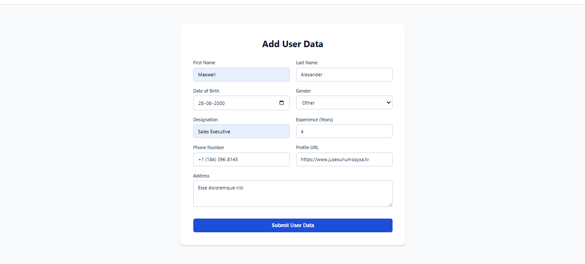
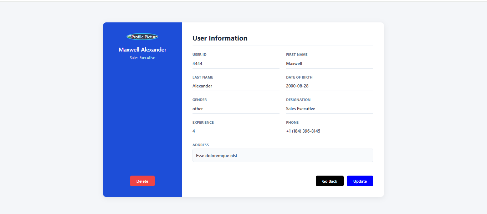
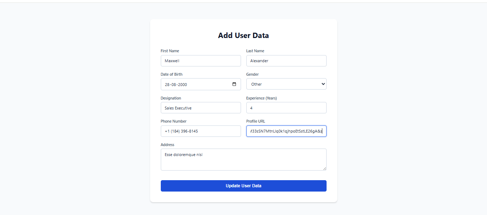
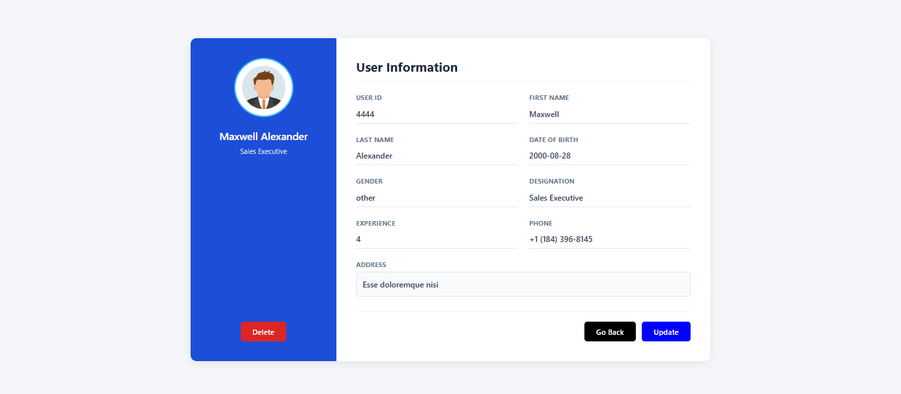

# JS User CRUD System 👨‍💻  

A User Management System built using HTML, CSS, JavaScript, Fetch API, and JSON Server. This application provides complete CRUD (Create, Read, Update, Delete) functionality for managing user data.
 
## ✨ Features  
* Add New User  
* View User Details  
* Update Existing User  
* Delete User  
* Dynamic Routing with URL Parameters  
* Fetch API Integration  
* JSON Server Backend  

## 🛠️ Technologies Used  
* HTML5  
* CSS3  
* JavaScript (ES6)  
* Fetch API  
* JSON Server  

## 📁 Project Structure  
```text
js-user-crud-system/
│
├── frontend/
│   ├── home.html
│   ├── userForm.html
│   ├── userDetails.html
│   ├── *.css
│   ├── *.js
│   └── screenshots/
│
├── backend/
│   └── users.json
│
└── .gitignore
└── README.md
```

## 🚀 Getting Started  

### Clone Repository  

```bash
git clone <repository-url>
```

### Start JSON Server

```bash
cd backend
json-server --watch db.json --port 500
```

### Run Frontend

Open `frontend/home.html` using Live Server.

## 📸 Screenshots

### Before Adding New User


### ➕ Adding New User



### ✅ After Adding New User


### Before Updating User



### ✏️ Updating User



### ✅ After Updating User



### 🗑️ Before Deleting User


### ❌ After Deleting User


## 🔮 Future Enhancements

* Search Users
* Form Validation
* User Filtering
* Dark Mode

## 👩‍💻 Author
**Brindhadevi S**


